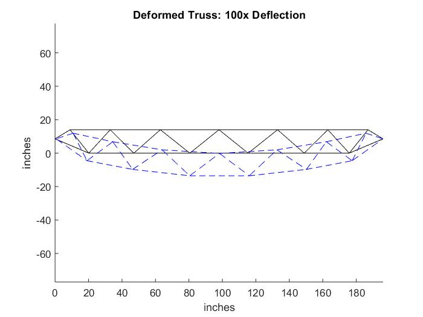
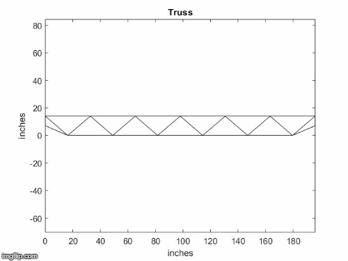

# 2D-Truss-Optimization

This project was created to aid in design of a truss for the 2018 annual ASCE/AISC student steel bridge competition. The matrix stiffness method is used to analyze trusses for first-order member forces and deflections, and gradient descent
is used to optimize the competition-defined cost function over a set of the truss's parameters. 

The nuts and bolts of using the repository are detailed below:

Project variable notation:
- r - real noninteger, 
- n - integer, 
- b - boolean, 
- a - array, 
- i,j,k- iterator variable

Files:
- Truss.m contains a Matlab class used to represent a physical 2D truss as 
        node coordinates and member cross sections 
- Optimizer.m contains a Matlab class used to create an optimization routine 
        for a Truss object
- AnalysisOfTrussMacrostructure.m is an example script that optimizes several 
        input truss configurations in search of a minimal cost truss 

Example:

Run the static method TrialDesign() in the Truss class(input 
Truss.TrialDesign() into the command window). The truss defined in 
TrialDesign is examined in detail below. 

By default, every Truss object has the following constant properties. 
These properties can only changed by modifiying the Truss class:

    nNumReactions = 3; %(Default (for pin-roller support) is 3; set to 4 for pin-pin)
    E = 2.9 * 10^7 %(Elastic Modulus, psi (default material is steel)) 
    rDensity = 0.284 %(lb/in^3)
    rYieldStrength = 3.6*10^4 %(psi)
        
    % Weighting Coefficients (set to ASCE bridge competition specs)
        a = 10;
        b = 100000;
        y = 100000;
        l = 100000;
        d = 0;
       
    rAreaScaling = 100 %(scales XC areas so that the scale is similar to that of 
                    %XY node coordinates (for better gradient descent performance)

The other object properties must be defined for each truss and are input 
into the constructor. These properties are listed and explained below:

    raNodes = [...

        0   50; %(This indicates the x and y coordinate of node 1)
        25  50;
        50  50;
        95  50;
        115 50;
        150 50;
        175 50;
        200 50;

        25  25;
        50  25;
        75  25;
        100 25;
        125 25;
        150 25;
        175 25;
        0   25;  %(Support 1 - last two nodes listed must be the supports)
        200 25]; %(Support 2)

    raNodeLock = ...
        [
        1 1; %(indicates node 1 may be moved in x and y directions)
        1 1;
        1 1;
        1 0; %(indicates node 4 may only be moved in x direction)
        0 1; %(indicates node 5 may only be moved in y direction)
        1 1;
        1 1;
        1 1;
        0 0; %(indicates node 9 cannot be moved)
        0 0;
        0 0;
        0 0;
        0 0;
        0 0;
        0 0;
        0 0;
        0 0];

    XC1 = 0.3125; %(arbitrary initial cross-sectional area value)
    raMembers = [1  2 XC1; 
               2  3 XC1; 
               3  4 XC1;
               4  5 XC1;
               5  6 XC1;
               6  7 XC1;
               7  8 XC1;
               16 9 XC1;
               9  10 XC1;
               10 11 XC1;
               11 12 XC1;
               12 13 XC1;
               13 14 XC1;
               14 15 XC1;
               15 17 XC1;
               1  16 XC1;
               2  9 XC1;
               3  10 XC1;
               4  11 XC1;
               5  13 XC1;
               6  14 XC1;
               7  15 XC1;
               8  17 XC1;

               1  9 XC1;
               2  10 XC1;
               3  11 XC1;
               4  12 XC1;
               5  12 XC1;
               6  13 XC1;
               7  14 XC1;
               8  15 XC1];

The first value of raLoads indicates the load on node 1 in x-direction. The 
second value indicates the load on node 1 in y-direction. The third value 
indicates the load on node 2 in x-direction, and so on. raLoads is (2m-3) x 1, since 
any degree of freedom at which a support acts are omitted. There cannot be loads on
the truss in these locations or the loads would be transferred directly to the supports. 
In practice, the y-direction of the second-to-last node and both directions of the last
node are constrained by supports.

    raLoads = [0 0 0 0 0 0 0 0 0 0 0 0 0 0 0 0 0 0 0 0 0 -600 0 -1200 0 -600 0 0 0 0 0];

Truss object is now created.
          
    truss1 = Truss(raNodes,raNodeLock,raMembers(:,1:2),raMembers(:,3),raLoads);

raParameters condenses all the modifiable parameters (i.e. the node 
coordinates in unlocked directions and the member areas) into one vector

    raParameters = truss1.GetParameters();

iSteps defines the number of gradient descent steps that will be performed

    iSteps = 20000;

rLearningRate defines alpha, the learning rate for gradient descent

    rLearningRate = 5e-6;

The Truss, the list of changeable parameters, and the gradient descent 
parameters are input into the optimizer

    [raParameters, raCost] = Optimizer.Run(truss1, raParameters,iSteps, rLearningRate);

The optimized Truss over raParameters is returned by Optimizer.Run().
Optimizer also sketches the Truss over time during the optimization, and
plots the cost function of the truss over time.
